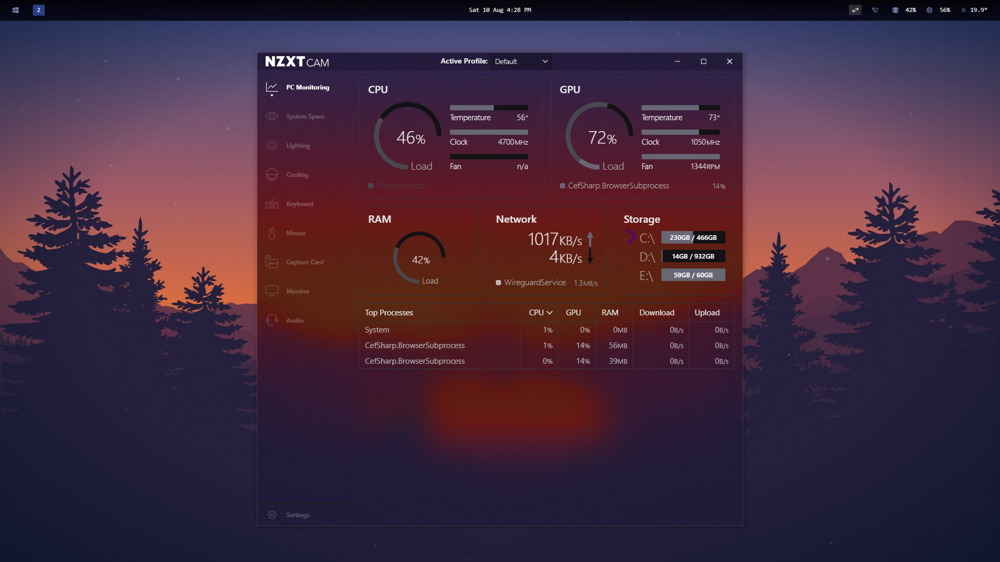

# kernel-themes
A set of themes designed to be run with [kernel](kernel.fish) and [kernel-theme-loader](https://github.com/EastArctica/kernel-theme-loader).

# Installation
1. Install [kernel](kernel.fish)
2. Add the [kernel-theme-loader](https://github.com/EastArctica/kernel-theme-loader) module
3. Place themes in `~/.config/kernel/themes/your-theme/`

# NZXT CAM Acrylic
A Windows 11 acrylic theme using the [acrylic](https://github.com/EastArctica/acrylic) module.

## Contributing
Contributions are welcome! Please submit issues or pull requests on the [GitHub repository](https://github.com/EastArctica/kernel-themes).

## License
Acrylic is licensed under the MIT License. See the [LICENSE](https://github.com/EastArctica/kernel-themes/blob/main/LICENSE) file for more information.
